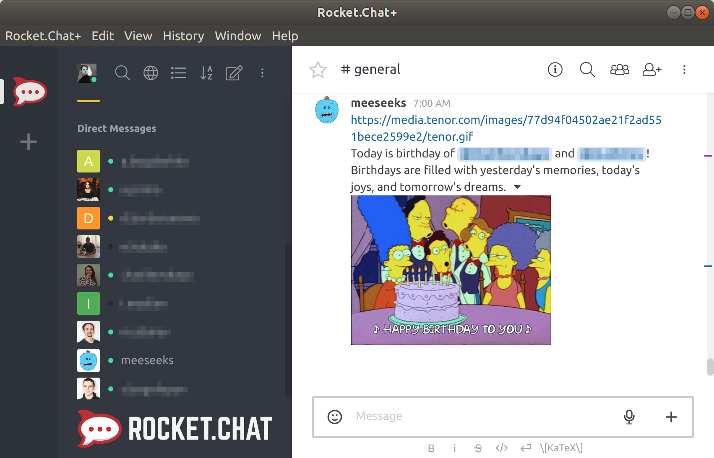

[](https://travis-ci.org/tolstoyevsky/hubot-happy-birthder)

# hubot-happy-birthder

Hubot script for writing birthday messages to users. It uses [Tenor](https://tenor.com) GIFs to make the messages more lively.

<p align="center">
    
</p>

## Features

* Asks freshmen to specify their date birth and reminds them about it if they ignore this request for some reason.
* Fetches a random GIF from [Tenor](https://tenor.com) before writing a birthday message to a birthday boy/girl. The `TENOR_SEARCH_TERM` environment variable stores a comma separated list of the tags which will be used when fetching GIFs. By default, the value of the variable is [thesimpsonsbirthday](https://tenor.com/search/thesimpsonsbirthday),[futuramabirthday](https://tenor.com/search/futuramabirthday),[rickandmortybirthday](https://tenor.com/search/rickandmortybirthday),[tmntbirthday](https://tenor.com/search/tmntbirthday),[harrypotterbirthday](https://tenor.com/search/harrypotterbirthday).
* Writes birthday messages to `#general`.
* Reminds users of the upcoming birthdays one day and a few days in advance. It's possible to specify how long before the event occurs the reminder should be triggered.
* Provides fault tolerance:
  * if Tenor is for some reason unavailable right now, the script will try to request it a number of times with delays;
  * if all the requests failed, users will receive their birthday messages anyway.
* Creates private channels in advance and invites all the users to the channels except the birthday boys/girls for the purpose of discussing the presents for them. Expired channels are automatically removed.

## Prerequisites

* The bot must be in the channel specified via the `BIRTHDAY_LOGGING_CHANNEL` environment variable.
* The bot has to have `view-full-other-user-info` permission.

## Installation

In hubot project repo, run:

`npm install git+https://github.com/tolstoyevsky/hubot-happy-birthder --save`

Then add **hubot-happy-birthder** to your `external-scripts.json`:

```json
[
  "hubot-happy-birthder"
]
```

## Configuration

The script can be configured via the following environment variables (called parameters).

| Parameter                           | Description | Default |
|-------------------------------------|-------------|---------|
| `TENOR_API_KEY`                     | Сlient key for privileged API access. This is the only **mandatory** parameter. | |
| `TENOR_BLACKLIST` | A comma separated list of the GIFs ids which will be excluded when choosing one from the list returned by Tenor. If the script randomly chooses a GIF from the response which belongs to the blacklist, the script sends one more request to Tenor. | [641ee5344bdc3f9f4d3ef52344dfe6bd](https://media.tenor.com/images/641ee5344bdc3f9f4d3ef52344dfe6bd/tenor.gif) |
| `TENOR_IMG_LIMIT`                   | Fetches up to the specified number of result, but not more than **50**. | 50 |
| `TENOR_SEARCH_TERM`                 | A comma separated list of tags which will be used when fetching GIFs from Tenor. | See [Features](#features) |
| `CREATE_BIRTHDAY_CHANNELS` | Specifies whether to create the birthday channels for the purpose of discussing presents for birthday boys/girls. All the users are invited to the channel except the birthday boy/girl. | false |
| `BIRTHDAY_CHANNEL_BLACKLIST` | A comma separated list of the users which won't be invited to the birthday channel when it's created. | |
| `BIRTHDAY_CHANNEL_MESSAGE` | The messages separated by `\|` which are sent to the birthday channel one by one. | `@%username% is having a birthday soon, so let's discuss a present.` |
| `BIRTHDAY_CHANNEL_TTL` | Specifies TTL (time to live) of the birthday channel. | 3 |
| `BIRTHDAY_LOGGING_CHANNEL` | Allows specifying the name of the channel which is used for logging the events related to birth dates. The bot must be in the channel (see the [Prerequisites](#prerequisites) sections). | hr |
| `COMPANY_NAME` | Allows specifying the company name which is used in the welcome message. | WIS Software |
| `HAPPY_REMINDER_SCHEDULER` | Allows specifying the frequency with which the script checks for nearest birthdays and writes birthday messages to users. The value of this parameter must follow the [Cron Format](https://github.com/node-schedule/node-schedule#cron-style-scheduling). | `0 0 7 * * *` |
| `NUMBER_OF_DAYS_IN_ADVANCE`  | Sets (in days) how long before the event occurs the reminder will be triggered. | 7 |

## Example Interaction

```
some.user >> @hubot birthday set matt 15.02.1954
hubot >> Saving matt's birthday.
some.user >> @hubot birthday set homer 12.05.1956
hubot >> Saving homer's birthday.
some.user >> @hubot birthdays list
hubot >> homer was born on 12.05.1956
hubot >> matt was born on 15.02.1954
```

## Known issues

When specifying a birth date for a particular user, the script may complain that it has never met the user before. In this case just ask the user to interact with the bot.

## Authors

See [AUTHORS](AUTHORS.md).

## Licensing

hubot-happy-birthder is available under the [Apache License, Version 2.0](LICENSE).

